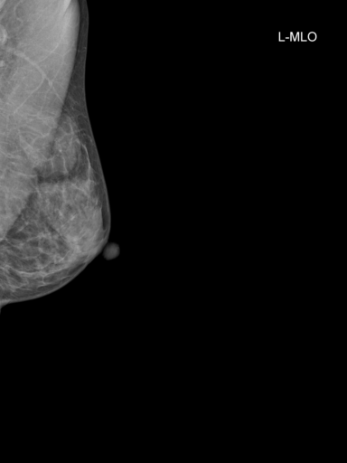
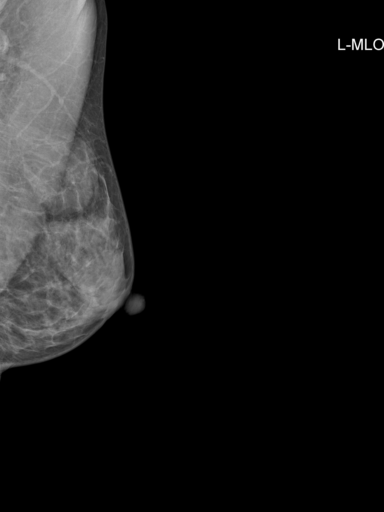
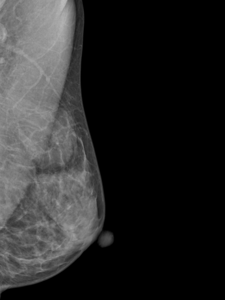
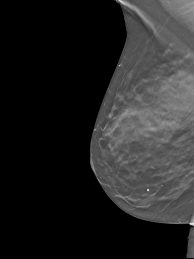
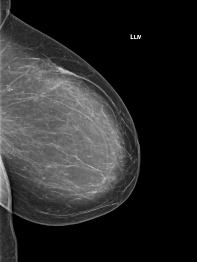
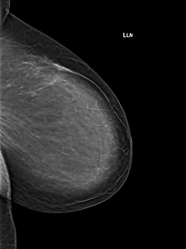
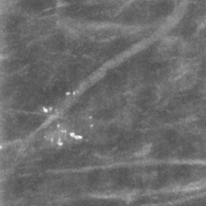
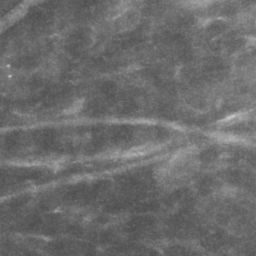
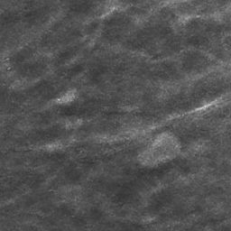
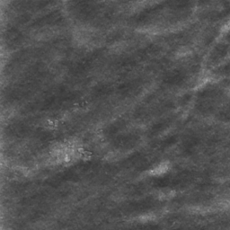

# DICOM Preprocessing

Implements a tool that preprocesses DICOM files into TIFF images. The primary motivation is to prepare DICOM images for use in computer vision tasks, with a focus on efficient storage and minimization of decode processing time.

### Transformation Sequence

Depending on the options used, the following transformations are applied to the DICOM image:

1. **Cropping** - if the `--crop` option is used, the image or volume is cropped such that all-zero rows and columns are removed
from the edges of the image.
2. **Resizing** - the image is resized to the target size, preserving the aspect ratio.
3. **Padding** - if the aspect ratio does not match the target size, the image is padded in the direction specified by the `--padding` option.

To enable mapping coordinates from the original image to the output image, the following TIFF tags will be set:
- `DefaultCropOrigin` - the origin of the initial cropping step as `(x, y)`
- `DefaultCropSize` - the size of the initial cropping step as `(width, height)`
- `DefaultScale` - the floating point scale of the resizing step as `(x, y)`
- `ActiveArea` - coordinates of the non-padded area of the image as `(left, top, right, bottom)`
- `PageNumber` - tuple of `(0, total)` indicating the total number of frames in the file


### Command Line Interface

```
Preprocess DICOM files into (multi-frame) TIFFs

Usage: dicom-preprocess [OPTIONS] <SOURCE> <OUTPUT>

Arguments:
  <SOURCE>  Source path. Can be a DICOM file, directory, or a text file with DICOM file paths
  <OUTPUT>  Output path. Can be a directory (for multiple files) or a file (for a single file)

Options:
  -c, --crop
          Crop the image. Pixels with value equal to zero are cropped away.
  -m, --crop-max
          Also include pixels with value equal to the data type's maximum value in the crop calculation
  -n, --no-components
          Do not use connected components for the crop calculation
  -b, --border-frac <BORDER_FRAC>
          Border fraction to exclude from crop calculation and grow final crop by
  -s, --size <SIZE>
          Target size (width,height)
      --spacing <SPACING>
          Target pixel/voxel spacing in mm (x,y or x,y,z)
  -f, --filter <FILTER>
          Filter type [default: triangle] [possible values: triangle, nearest, catmull-rom, gaussian, lanczos3, max-pool]
  -p, --padding <PADDING_DIRECTION>
          Padding direction [default: zero] [possible values: zero, top-left, bottom-right, center]
      --no-padding
          Disable padding
  -z, --compressor <COMPRESSOR>
          Compression type [default: packbits] [possible values: packbits, lzw, uncompressed]
  -v, --volume-handler <VOLUME_HANDLER>
          How to handle volumes [default: keep] [possible values: keep, central-slice, max-intensity, interpolate, laplacian-mip]
  -t, --target-frames <TARGET_FRAMES>
          Target number of frames when using interpolation [default: 32]
      --mip-weight <MIP_WEIGHT>
          LaplacianMip: weight for MIP Laplacian contribution (default 1.5, higher preserves calcifications better) [default: 1.5]
      --skip-frames <SKIP_FRAMES>
          LaplacianMip: frames to skip at start and end of volume (default 5, trims noisy edge frames) [default: 5]
      --projection-mode <PROJECTION_MODE>
          LaplacianMip: projection mode for computing the central frame (central-slice or parallel-beam) [default: parallel-beam]
      --strict
          Fail on input paths that are not DICOM files, or if any file processing fails
  -w, --window <WINDOW>
          Window center and width
  -h, --help
          Print help
  -V, --version
          Print version
```


### Example Images

Below are example images demonstrating the effects of different cropping options (resized to 384x512):

| Original Image | Cropped (Zero Pixels) | Cropped (Zero + Maximum Pixels) |
|----------------|----------------|----------------------|
|  |  |  |

The maximum pixel cropping option (`-m`, `--crop-max`) prevents certain image watermarks from impacting the cropping calculation. Effective cropping can maximize the information extracted from the image at a given
resolution budget.

Below are example images demonstrating various volume handling options. Laplacian MIP uses pyramid-based fusion to combine central slice detail with calcification visibility from MIP [[1]](#references).

| Central Slice | Maximum Intensity | Laplacian MIP |
|---------------|-------------------|---------------|
|  |  |  |
|  |  |  |
|  |  |  |

The Laplacian MIP handler supports different projection modes for computing the central frame used in pyramid fusion. The default (`parallel-beam`) sums all slices along the z-axis, providing better depth integration. `central-slice` uses the middle slice directly, preserving single-slice sharpness.

| Parallel Beam (default) | Central Slice |
|-------------------------|---------------|
|  |  |
|  |  |
|  |  |


### Optimization Notes

#### Compression and ZFS

Below is a comparison of file sizes for 26,474 digital breast tomosynthesis (DBT) volumes after preprocessing to TIFF when stored in ZFS.
Example decode times from a local NVMe SSD are also provided for each configuration. Note that the Rust PackBits decoder seems suboptimal,
as PackBits decoding is generally faster than LZW.


| TIFF Compression | Total Size | Total Size (LZ4 Compressed) | Peak Decode Time (ms) |
|------------------|------------|-----------------------------|-----------------------|
| Uncompressed     | 12TB       | 6.5TB                       | 3.204                 |
| Packbits         | 8.3TB      | 6.5TB                       | 67.288                |
| LZW              | 5.6TB      | 5.6TB                       | 44.080                |


PackBits compression does not yield a substantial reduction in stored file size on ZFS. The primary
determinant of compression algorithm then becomes the network bandwidth between the storage and compute nodes.
Uncompressed files will require higher bandwidth to transfer, but do not require decompression on the compute node. Furthermore, the elimination of decompression frees the CPU to do other train-time tasks like augmentation. Note that TrueNAS will store compressed blocks in adaptive replacement cache (ARC), thus uncompressed and PackBits compressed files will have similar memory footprint.

In summary, if you have sufficient storage capacity, network bandwidth, and are using an access pattern that saturates the network link, uncompressed TIFFs are a good choice. Local flash storage will be bottlenecked
by the decompression step, so uncompressed TIFFs are an ideal choice for maximum throughput.

#### Access Patterns

When loading preprocessed TIFFs from HDDs over a local network, access patterns become a significant determinant of throughput. Spinning rust HDDs suffer from high latencies, and thus random access patterns are suboptimal. Below is a comparison of sequential and random access patterns for a the dataset described above.
This is not an exact comparison, as the order of file reads differs between the two and thus the slice chosen from each DBT volume is different. However, the substantial difference in throughput demonstrates the impact of access patterns.

| Access Pattern | Throughput (files/s) |
|----------------|----------------------|
| Sequential     | 641.4                |
| Random         | 9.805                |

#### ARC

TrueNAS will store retrieved data in ARC. For sufficiently small datasets, it is possible that the entire dataset can be stored in ARC, thus eliminating bottlenecks associated with disk I/O and random access patterns. Below is a comparison of two benchmark runs, both using random access patterns with a consistent
seed between runs. The second run benefits from ARC, as the dataset is smaller than the available ARC capacity.

| Dataset Size | Throughput (files/s) |
|--------------|----------------------|
| Run 1        | 9.836                |
| Run 2        | 820.5                |

Given sufficient network bandwidth and ARC capacity, operations on datasets that have been cached will likely be bottlenecked by decode time.


### Manifest Creation

When dealing with large datasets stored on slow drives, it is useful to create a manifest of the dataset.
This manifest should track the preprocessed file paths that comprise the dataset, as well as the inode of the
preprocessed file (for optimizing sequential read performance). A binary, `dicom-manifest`, is provided to create a manifest from a directory of preprocessed TIFFs. It is assumed that the preprocessed TIFFs are named in the format of `{study_instance_uid}/{sop_instance_uid}.tiff`. Likewise, it is assumed that `dicom-manifest` will be given a source path at the root of the preprocessed dataset.

The manifest will contain the following columns, sorted by (`study_instance_uid`, `sop_instance_uid`):
- `study_instance_uid` - the study instance UID of the preprocessed file
- `sop_instance_uid` - the SOP instance UID of the preprocessed file
- `path` - the path of the preprocessed file relative to the source path
- `inode` - the inode number of the preprocessed file
- `width` - the width of the preprocessed file
- `height` - the height of the preprocessed file
- `channels` - the number of channels in the preprocessed file
- `num_frames` - the number of frames in the preprocessed file

Example usage:

```
dicom-manifest /path/to/preprocessed/dataset /path/to/manifest.csv
```

### Python Bindings

Python bindings are provided via the `pyo3` crate. The following features are supported:
 - Loading preprocessed TIFFs into Numpy arrays
 - Iterating, sorting, and discovering DICOM or TIFF files from various sources
 - Direct preprocessing of a DICOM file or buffer into a Numpy array

Direct preprocessing of a DICOM file or buffer into a Numpy array is achieved using a temporary TIFF file.
This temporary file is spooled, having an in-memory capacity of 64MB with additional space allocated on disk as needed.
This spool size was chosen to accommodate most preprocessed 2D images without being overly burdensome.
In the future we will support a direct conversion, avoiding the need for an intermediate TIFF file.


### CT Scan Stacking

CT scans are often represented using multiple DICOM files, one per axial slice. 
A CLI tool is provided to combine per-slice TIFF files (created through the preprocessing flow described above)
into a single multi-frame TIFF. 
This tool relies on accompanying CSV or Parquet metadata file which gives the `InstanceNumber`
for each `SOPInstanceUID` to properly order the frames in a series.


```
Combine single-frame TIFF files into multi-frame TIFFs

Usage: tiff-combine [OPTIONS] <SOURCE> <METADATA> <OUTPUT>

Arguments:
  <SOURCE>    Directory containing TIFF files with structure study_instance_uid/series_instance_uid/sop_instance_uid.tiff
  <METADATA>  CSV or Parquet file with series_instance_uid, sop_instance_uid, and instance_number columns
  <OUTPUT>    Output directory for combined multi-frame TIFFs

Options:
  -v, --verbose  Enable verbose logging
  -h, --help     Print help
  -V, --version  Print version
```

### References

1. Wei J, Chan HP, Helvie MA, Roubidoux MA, Neal CH, Lu Y, Hadjiiski LM, Zhou C. Synthesizing Mammogram from Digital Breast Tomosynthesis. *Phys Med Biol.* 2019;64(4):045011. doi:[10.1088/1361-6560/aafcda](https://doi.org/10.1088/1361-6560/aafcda)