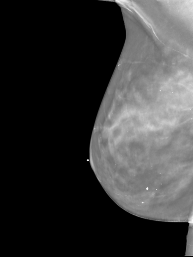

# DICOM Preprocessing

Implements a tool that preprocesses DICOM files into TIFF images. The primary motivation is to prepare DICOM images for use in computer vision tasks, with a focus on efficient storage and minimization of decode processing time.

### Transformation Sequence

Depending on the options used, the following transformations are applied to the DICOM image:

1. **Cropping** - if the `--crop` option is used, the image or volume is cropped such that all-zero rows and columns are removed
from the edges of the image.
2. **Resizing** - the image is resized to the target size, preserving the aspect ratio.
3. **Padding** - if the aspect ratio does not match the target size, the image is padded in the direction specified by the `--padding` option.

To enable mapping coordinates from the original image to the output image, the following TIFF tags will be set:
- `DefaultCropOrigin` - the origin of the initial cropping step as `(x, y)`
- `DefaultCropSize` - the size of the initial cropping step as `(width, height)`
- `DefaultScale` - the floating point scale of the resizing step as `(x, y)`
- `ActiveArea` - coordinates of the non-padded area of the image as `(left, top, right, bottom)`


### Command Line Interface

```
Preprocess DICOM files into (multi-frame) TIFFs

Usage: dicom-preprocess [OPTIONS] <SOURCE> <OUTPUT>

Arguments:
  <SOURCE>  Source path. Can be a DICOM file, directory, or a text file with DICOM file paths
  <OUTPUT>  Output path. Can be a directory (for multiple files) or a file (for a single file)

Options:
  -c, --crop                         Crop the image. Pixels with value equal to zero are cropped away.
  -m, --crop-max                     Also include pixels with value equal to the data type's maximum value in the crop calculation
  -s, --size <SIZE>                  Target size (width,height)
  -f, --filter <FILTER>              Filter type [default: triangle] [possible values: triangle, nearest, catmull-rom, gaussian, lanczos3]
  -p, --padding <PADDING_DIRECTION>  Padding direction [default: zero] [possible values: zero, top-left, bottom-right, center]
  -z, --compressor <COMPRESSOR>      Compression type [default: packbits] [possible values: packbits, lzw, uncompressed]
      --strict                       Fail on input paths that are not DICOM files
  -h, --help                         Print help
  -V, --version                      Print version
```


### Example Images

Below are example images demonstrating the effects of different cropping options (resized to 512x384):

| Original Image | Cropped (Zero Pixels) | Cropped (Zero + Maximum Pixels) |
|----------------|----------------|----------------------|
|  |  |  |

The maximum pixel cropping option (`-m`, `--crop-max`) prevents certain image watermarks from impacting the cropping calculation. Effective cropping can maximize the information extracted from the image at a given
resolution budget.

Below are example images demonstrating various volume handling options:
| Central Slice | Maximum Intensity |
|----------------|-------------------|
|  |  |